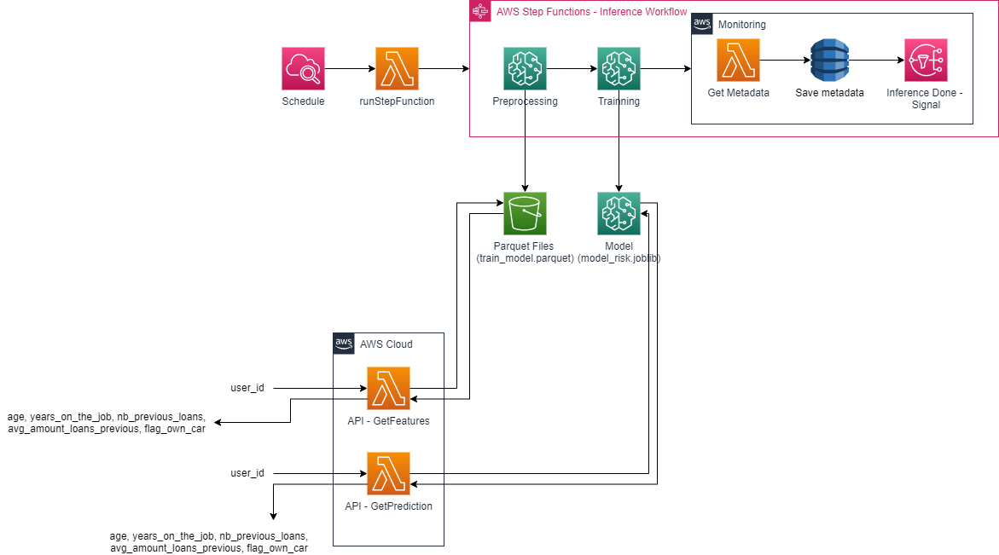
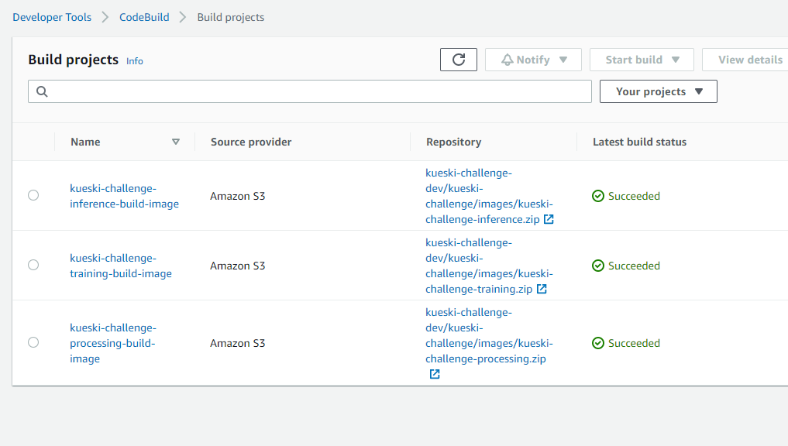
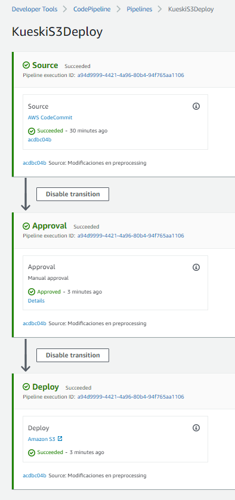
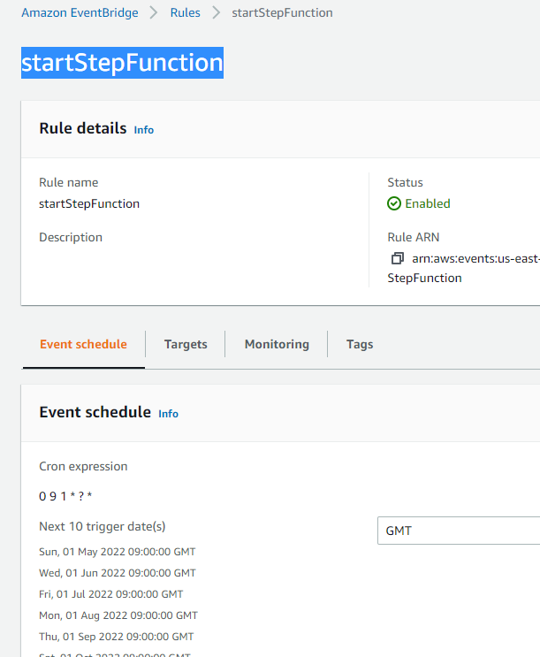
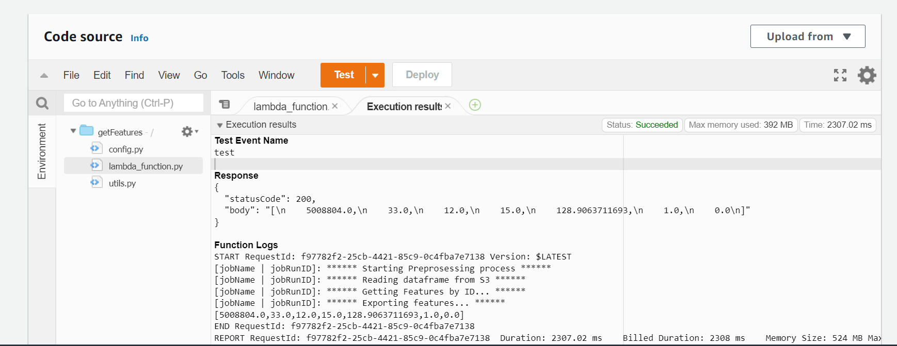
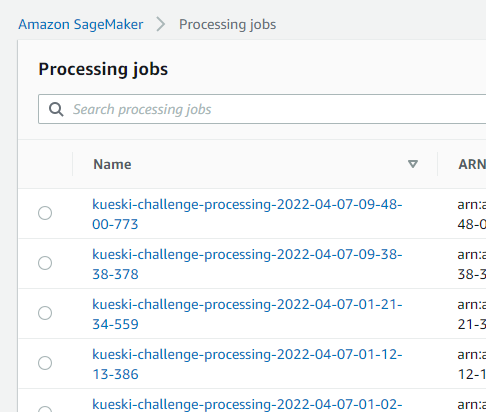
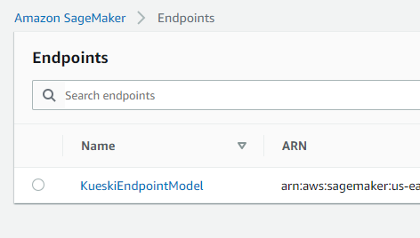
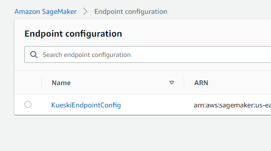
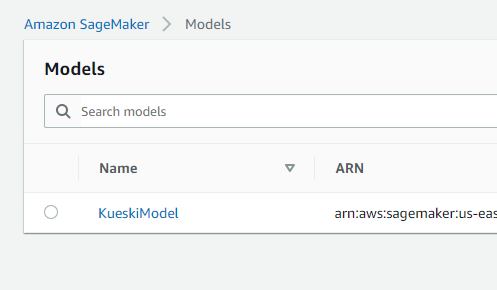

# KueskiChallenge

## Index

<ol>
  <li>Architecture</li>
  <li>AWS Services
    <ol>
      <li>S3 Information</li>
      <li>CodeCommit</li>
      <li>CodeBuild</li>
      <li>CodePipeline</li>
      <li>SNS</li>
      <li>CloudWatch Event Rule or EventBringe</li>
      <li>Lambdas</li>
      <li>Sagemaker</li>
    </ol>
  </li>
  <li>Repository structure</li>
</ol>

---
## 1.1 Architecture

> **Description:** The architecture idea for this challenge, It's get a pipeline with the ProcessingJob and TrainningJob in the same StepFunctions Workflow. The workflow is started by a rule on EventBrigde every first day of month, calling a Lambda Functions that this one gets all the parameters to execute StepFunction.
Finally, The architecture has a monitoring group where all metrics from Sagemaker would be save and sends an email by SNS Topic
>
>

---

## 2. AWS Services
## 2.1 S3 Information
>**Bucket name**: kueski-challenge-dev  
>**Repository Path:** s3://kueski-challenge-dev/sources/   
>**Dataset Input for the Workflow:** s3://kueski-challenge-dev/landing/  
>**Preprocessing Output:** s3://kueski-challenge-dev/preprocessing/  
>**Models Output**: s3://kueski-challenge-dev/train_models/

---
## 2.2. CodeCommit 
> Repository Link: https://git-codecommit.us-east-1.amazonaws.com/v1/repos/kueski-challenge
>
>Branchs:
>- main (This is the branch that CodeCommit sees)
>- dev
>
>

---
## 2.3. CodeBuild 
>| Name  | Source provider |  Repository |
>|---|---|---|
>| kueski-challenge-training-build-image  |  	Amazon S3 |  	kueski-challenge-dev/kueski-challenge/images/kueski-challenge-training.zip | 
>|  kueski-challenge-processing-build-image | 	Amazon S3  |  	kueski-challenge-dev/kueski-challenge/images/kueski-challenge-processing.zip |  
>| kueski-challenge-inference-build-image  |  	Amazon S3 |  kueski-challenge-dev/kueski-challenge/images/kueski-challenge-inference.zip|  
>
>
>

---
## 2.4. CodePipeline
>Project name: KueskiS3Deploy  
>Stages:
>>- Source: Read for any change in AWS CodeCommit Repository  
>>- Approval: Manual approval for review before deploy. Send an email by SNS Topic  
>>- Deploy: Deploy CodeCommit Repository in a specific S3 bucket   
>
>

## 2.5. SNS

>Topic: KueskiPipelineApproval  
>Description: Sends an email when CodePipeline runs  
>

## 2.6. CloudWatch Event Rule or EventBringe

>Rule: startStepFunction  
>Description: It's for stepfunction execution and retrainning model (every month)    
>

## 2.7. Lambdas 

>**API: getFeatures**  
>_Code_: src\scripts\lambdas\kueski-challenge-GetFeatures.py  
>
>
> **API: getPrediction**  
> _Code:_ src\scripts\lambdas\kueski-challenge-GetPredictions.py  
> 
>
>**Lambda Step Function: runStepFunction**  
>_Description:_ Set and sends parameters before starts StepFunctions Workflow

## 2.8. Sagemaker

> **PreprocessingJob**  
> _Code:_ src\scripts\sagemaker\kueski-challenge-preprocessing.py  
> _Container:_ kueski-challenge-processing:latest  
> 
>
> **TrainningJobs**  
> _Code:_ src\scripts\sagemaker\kueski-challenge-preprocessing.py  
> _Container:_ kueski-challenge-trainning:latest  
>
> **Inference**  
> _Code:_ src\scripts\lambdas\kueski-challenge-GetPredictions.py  
> _Container:_ kueski-challenge-inference:latest  
> - Endpoint: KueskiEndpointModel
> - Endpoint Config: KueskiEndpointConfig
> - Model: KueskiModel
> 
> 
> 
> 

---
## 3. Repository structure

<ul>
  <li>ChallengeInfo --> Information from Challenge</li>
  <li>Documentation --> Resources and files links with Documentation
    <ul>
      <li>images --> Here're save all images from this document</li>
    </ul>
  </li>
  <li>src --> From here is where all scripts are save
    <ul>
      <li>resources --> Like the jsons that I used for StepFunction creation</li>
      <li>scripts
        <ul> 
            <li>lambdas --> Here are save the APIs scripts</li>
            <li>sagemaker --> Scripts from PreprocessingJob and TrainningJob</li>
            <li>state-machine --> Last json with all Workflow configuration</li>
        </ul> 
    </ul>
  </li>
</ul>
